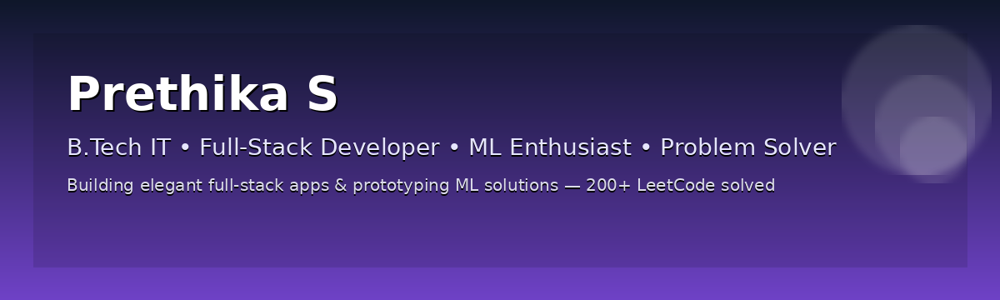

<!--
  Profile README for GitHub user: prethika-s
  Drop this file into a repo named exactly: `prethika-s`
-->

<!-- HERO / TOP -->
<h1 align="center">Hi 👋, I'm Prethika S</h1>

  <strong> Full-Stack Web Developer • Problem Solver</strong>

  
  
  
  

---

<!-- PROFILE STATS -->
## 📊 GitHub stats
<!-- Dynamic stats (replace theme if you prefer) -->

  
  

---

## 💡 About Me
- Full-stack web developer (React, Node.js, Express) and problem-solver — **200+ LeetCode** + **1600+ SkillRack** solved. 
- I build practical full-stack apps (authentication, RBAC, REST APIs, real-time charts) and prototype ML projects (CNNs for plant/herb identification). 
---

## 🛠️ Tech & Tools
**Languages:** Java, JavaScript (ES6+)  
**Frontend:** HTML5, CSS3, React.js  
**Backend:** Node.js, Express.js  
**Databases:** MySQL, MongoDB, CouchDB (project experience)  
**Other:** Git, GitHub, Postman, ExcelJS, Recharts, JWT, RBAC. 

---

## 🚀 Projects (highlights)

### Mindly — Expense Tracker  
- JWT authentication and RBAC, RESTful APIs with Node.js & Express, real-time visualizations with Recharts, Excel export via ExcelJS. (See repo: `ExpenseTracker`.) 

### Blogify — AI-driven Blogging App  
- Full-stack blogging platform with JWT auth, role-based dashboards, Gemini API + GraphQL integration for AI content generation, and a custom markdown editor with image upload. (See repo: `mern-blogging-app`.) 

### Train Traffic and Congestion Control — SIH2025  
- Simulation / control project for Smart India Hackathon 2025. (Repo: `Train-Traffic-and-Congestion-Control`.) 

### Daily-DSA-Problems  
- Daily practice repository with solutions (leveraging Java). Great to demonstrate consistency and algorithmic skill. 

---

## 📫 Contact
- ✉️ **Email:** mailstosprethika@gmail.com

---

## ✨ Want to collaborate?
- I love working on full-stack & ML projects. If you have an idea, open an issue in any repo or DM me on LinkedIn.

---

---

## 📈 Commit calendar & fun animations

  <!-- Contribution heatmap (commit calendar) -->
  

  <!-- Banner (upload ./prethika_banner.png to repo root for this to show) -->
  

  <!-- Animated / live stats & playful badges -->
  
  &nbsp;
  
  &nbsp;
  

